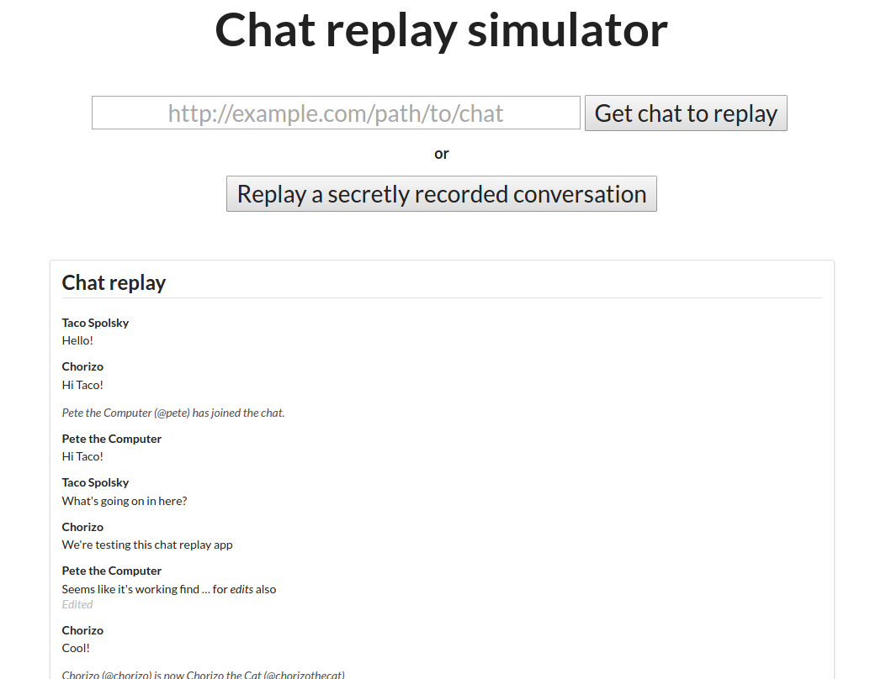

# Chat simulator
Original Task: https://gist.github.com/danlec/b0fbfb70f9521b8787e4

Demo: http://yarunluon.github.io/chat-replay/

## Usage
1. (Recommended) `nvm install` to set the correct node version. Requires [nvm](https://github.com/creationix/nvm) to be installed.
1. `npm install` will install all the dependencies.
1. `npm start` will start the development server at http://localhost:3000/

## Build production files
`npm run build` will generate the production files in the `build/` folder.

## Architecture
- Separation of concerns
    - API methods are in their own file
    - [Redux-like](http://redux.js.org/) reducer to transform state (pure function)
    - Emphasis on stateless design. View rendering is kept separate from data transformation. There is very little state information in the data.
- [AirBnB Style Guide](https://github.com/airbnb/javascript) - To ensure quality code
- [EditorConfig](http://editorconfig.org/) - Ensure consistent editor configurations across IDEs
- [nvmrc](https://github.com/creationix/nvm#nvmrc) - Standardize node development environment
- [Travis-CI](https://travis-ci.org/) - Continuous integration. Always lint, build, and test the latest pushes to GitHub

## Technologies used
For faster development and to create a richer user experience, existing frameworks and libraries were used
- [React](https://facebook.github.io/react/) - JavaScript view management library
- [Lodash](https://lodash.com/) - Utility library to transform data
- [Semantic-UI React](http://react.semantic-ui.com/) - React version of Semantic-UI which is a UI framework. Similar to Bootstrap.
- [Create React App](https://github.com/facebookincubator/create-react-app) - Zero configuration script to generate a React app and supporting build tools. E.g., WebPack, Jest, Babel, ESLint
- [Markdown-it (React)](https://github.com/alexkuz/markdown-react-js) React version of Markdown-it which is a library to convert text to Markdown

## TODOs
- Symbolically link `@mentions`. The plugin for Markdown-it does not work and I was running out of time.
- Tests - Jest is already installed, but no tests were written. Tests for the reducer are the easiest to write.
- Better styling - Only basic styling was applied to the chat simulator. Given more time, something more fun would be used.
